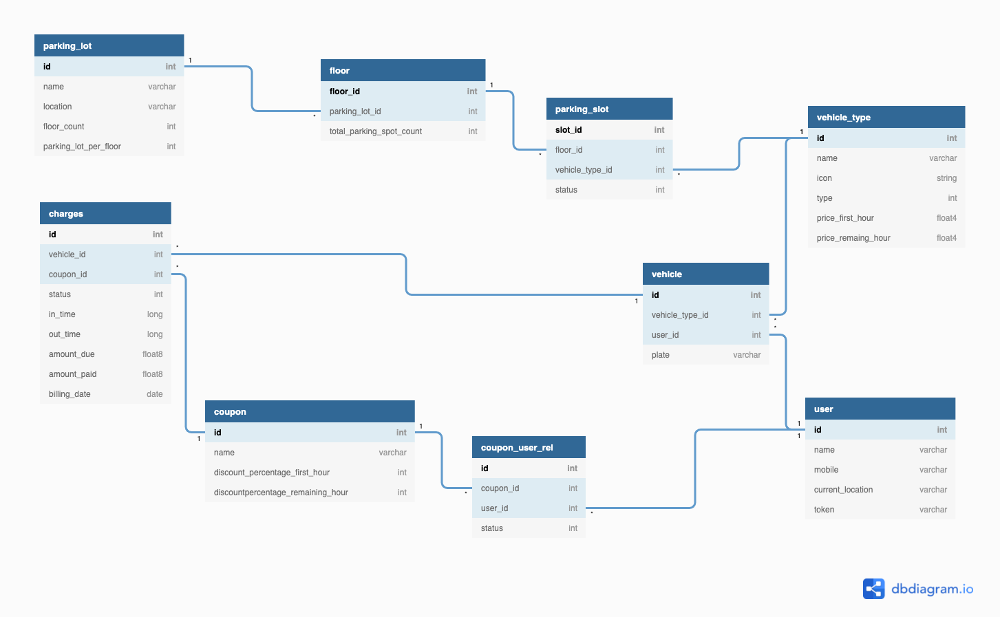

# ParkyPark
## Android Application which helps to find a parking and pick up smoothly

## Project Requirements

- Kotlin:       1.4.31
- Groovy:       3.0.7
- JVM:          11.0.13 (Oracle Corporation 11.0.13+10-LTS-370)

# Notable Dependencies used in the project
1. Dependency injection - dagger hilt
2. Database - room
3. Android architecure components
4. Google map sdk
5. Firebase auth
6. retrofit and okhttp
7. Navigation component
8. RxJava

SQLite Database schema

Note :: this is the rough version made some major changes in the final project.

## Assumptions

1. For the development sake I created the data and pre-populated the db for the first time when the user opens the application.
2. Parking lot table contains 4 parking lots. Each parking lot has 2 floors and each floor has 5 parking spaces. (To modify these values please check PrePopulateDatabase.kt)
3. Parking lots lat and long are predefined. 
4. User location also pre defined.

## Modules

1. Home
    - Get Parking Details
    - Map
    - Coupon
3. Find parking
4. Allotted parking details
4. Booking history
5. Booking summary
        
# Home 

Home package contains MainActivity. It is the only activity used in this project. It holds the responsibility to load all the required fragments.

# Get Parking Details

This package is like an entry point for the user. GetParkingDetailsFragment has a form consists of vehicle type, vehicle, coupon code and parking modes (park now or reservation)
After the user entered all the details they can simply click find parking button.

# Find parking

The Find parking button takes the user to FindParkingDialogFragment. It is a bottom sheet dialog fragment. There is nothing special in the ui of this fragment. But this fragment holds the responsibility to select an optimal parking lot for the user. 
    
  Algorithm first gets all the available parking lots for the selected vehicle type. Then get the distance in km (parking lot - user ) using google directions api. Based on the distance we can narrow down one parking lot which is nearest to the user. Then it allocates the parking space for the vehicle.
  
#  Allotted parking details

This fragment shows all the parking lot, floor, space and distance to the user. Users can either confirm the allotment or they can cancel it. Once they confirmed the allotment ui will show the scan and park button. I didn't add any QR scanner but it is my idea. when user clicks the button thats it Parking space status will be changed as Active.

# Booking history (Fee collection / transaction summary)

Booking history will be in the Navigation drawer. Users can check all the transactions and all the active parkings here. Users can pay the bill and pick up their vehicle here. When the user clicks pay_and_pickup button Pickup bottom sheet dialog fragment will display the charges. Users can pay and collect their vehicle there.

# Limitations
1. No support for dark mode
2. The layouts are not intended for tablets. The majority of the layout can be reused for tablets.
3. Reservation is not yet supported.
4. A map that only shows the locations of the parking lots and their users.
